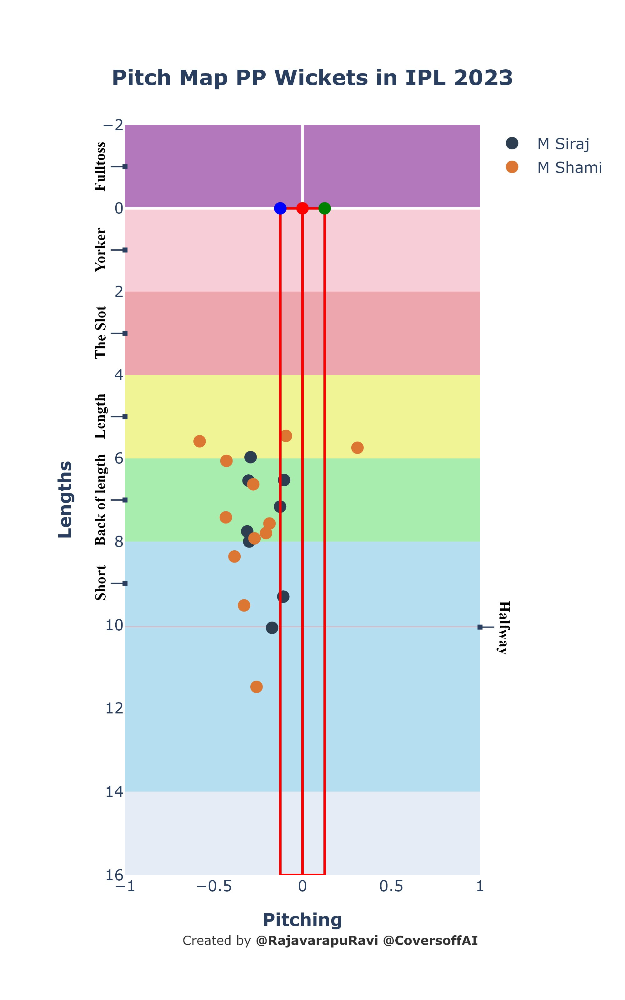
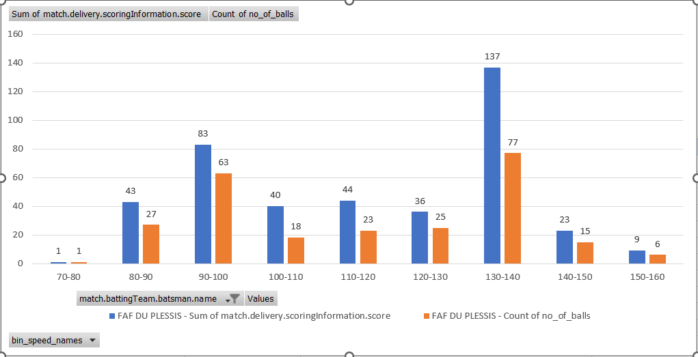
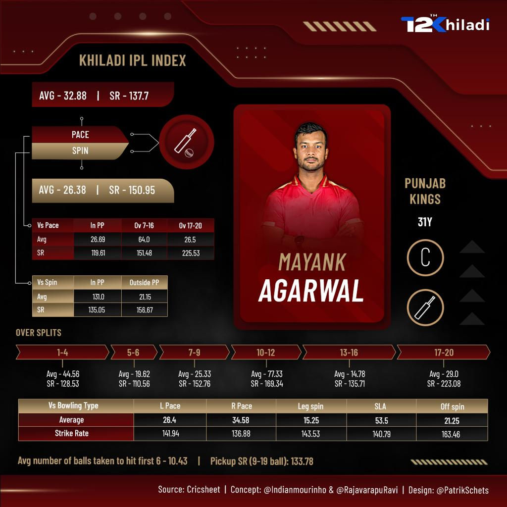
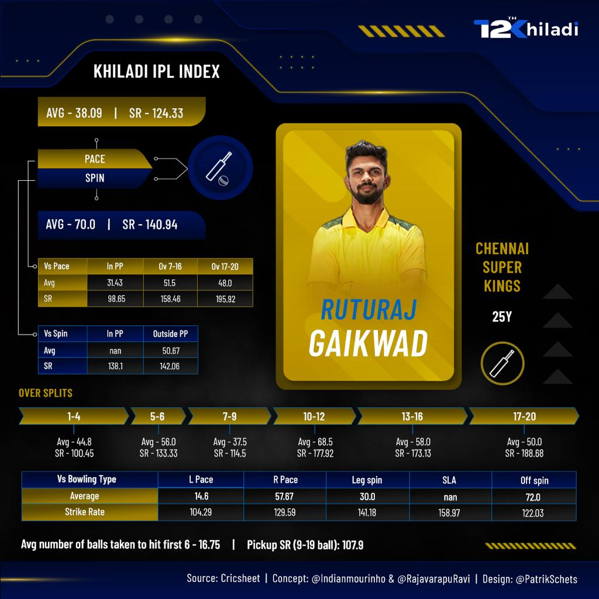
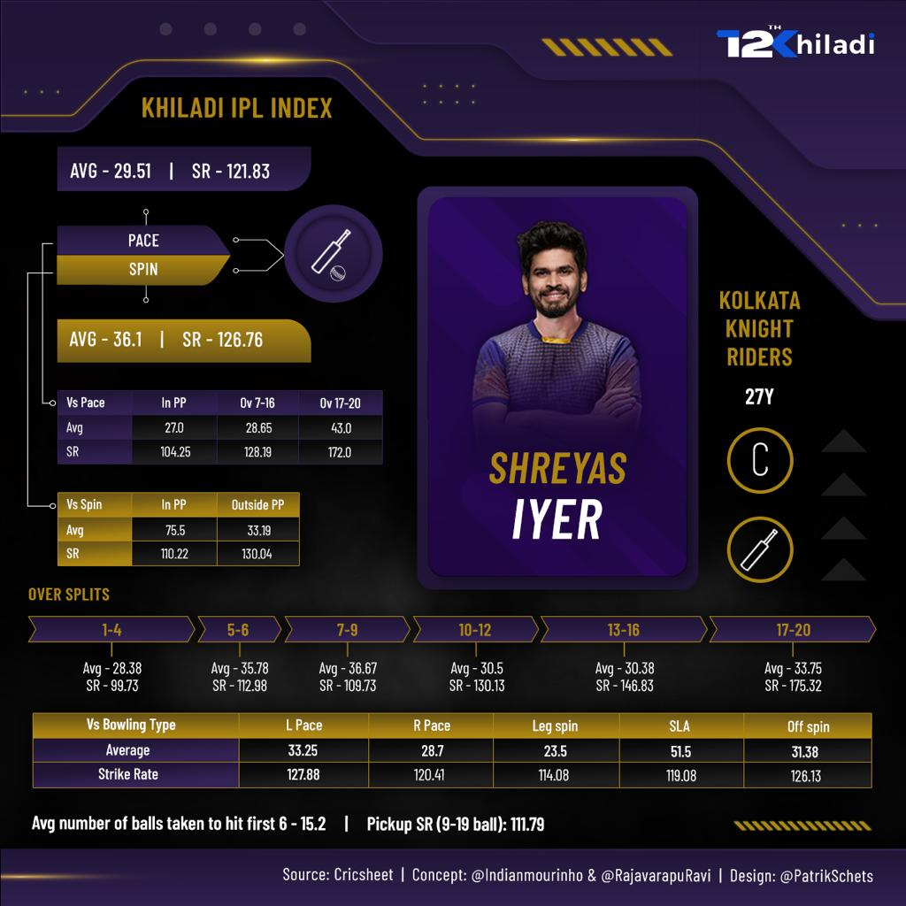
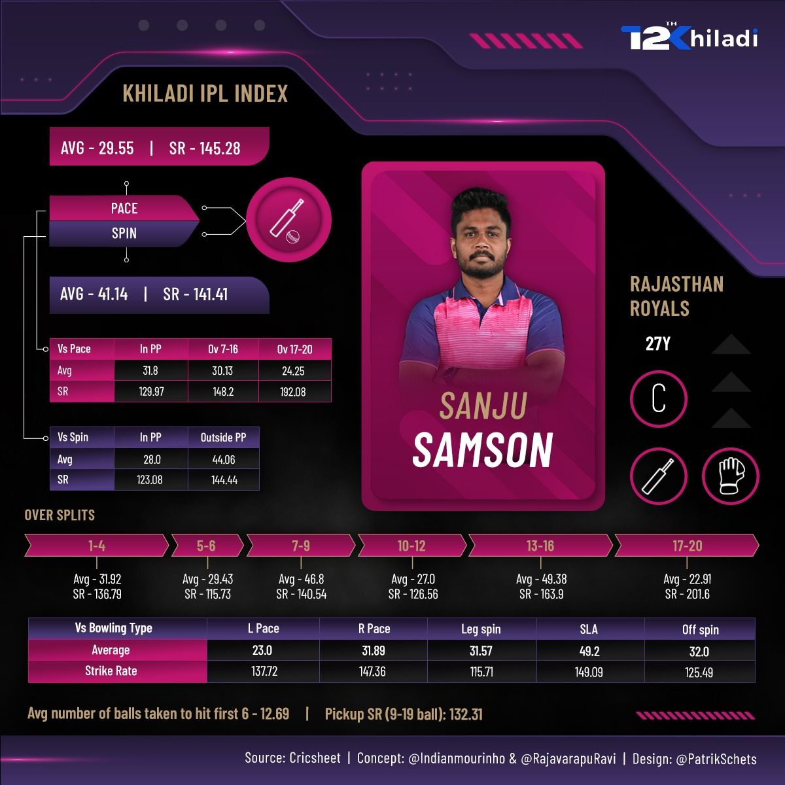

---

# 🏏 **Cricket Analytics Portfolio**

Welcome to my Cricket Analytics Portfolio! This repository highlights my work in **cricket data analysis, predictive modeling, and visualization** for tournaments like **IPL, T20 World Cup, PSL, and ODI World Cup**. I have combined **data science expertise** and **cricketing knowledge** to develop insights and tools for analysts, broadcasters, and cricket enthusiasts.  

Whether it’s creating **interactive dashboards**, analyzing **player performance**, or building predictive models, my projects showcase my ability to extract actionable insights and develop solutions that meet **real-world cricketing challenges**.

---

## **Table of Contents**
1. [ODI World Cup - Player Matchup Analysis](#1-odi-world-cup---player-matchup-analysis)  
2. [IPL Player Impact Analysis](#2-ipl-player-impact-analysis)  
3. [Venue Performance Analysis](#3-venue-performance-analysis)  
4. [Hawk-Eye Data Analysis](#4-hawk-eye-data-analysis)  
5. [Khiladi Index - Player Performance Ranking](#5-khiladi-index---player-performance-ranking)  
6. [My IPL Predictions App](#6-my-ipl-predictions-app)  
7. [T20 World Cup 2022 Analysis Thread](#7-t20-world-cup-2022-analysis-thread)  

---

## **1. ODI World Cup - Player Matchup Analysis**

**Description**:  
Analyzed batter vs. bowler matchups and venue-specific trends in ODI World Cup matches to identify **key players in critical moments**. This project provided actionable insights for **analysts and broadcasters**.

**Highlights**:
- Created **player impact profiles** based on match context (bowler types, batting position).  
- Developed visualizations showing batter/bowler matchups and venue statistics.  

**Media**:
-  *(Replace with an actual screenshot)*

**Links**:
- [Interactive Dashboard](#) *(Add the link)*  

---

## **2. IPL Player Impact Analysis**

**Description**:  
Built predictive models to evaluate **player impact in IPL matches**, factoring in match context, pressure situations, and opposition strength. Developed tools for exploring player stats interactively.

**Highlights**:
- Developed a **Streamlit app** to visualize player stats and matchups.  
- Leveraged **XGBoost** and **Random Forests** for predictive modeling.  

**Media**:
-  *(Replace with an actual screenshot)*

**Links**:
- [Streamlit App](https://x.com/RajavarapuRavi/status/1770830457204076626?t=uSPlLA4Q_I3R2HH9Pkd0-Q&s=19)  

---

## **3. Venue Performance Analysis**

**Description**:  
Analyzed pitch dynamics and venue-specific trends across tournaments like IPL, T20WC, and PSL. Identified **high-scoring venues**, bowler-friendly grounds, and weather impacts.  

**Highlights**:
- Created dashboards comparing venue stats across tournaments.  
- Delivered actionable insights for broadcasters during live matches.  

**Media**:
-  *(Replace with an actual screenshot)*  

**Links**:
- [Interactive Dashboard](#) *(Add the link)*  

---

## **4. Hawk-Eye Data Analysis**

**Description**:  
## PitchMap Analysis

## Runs vs Different Ball Speeds - Faf du Plessis

Used **Hawk-Eye data** to analyze ball tracking, focusing on **bowling lengths, line variations, and impact zones**. Automated workflows to process large datasets efficiently.  

**Highlights**:
- Visualized bowling lengths and batter weaknesses against delivery types.  
- Provided insights into powerplay wickets taken by top IPL bowlers.

**Media**:  
-  *(Replace with an actual screenshot)*  

**Tweets**:  
- [PitchMap of Powerplay Wickets in IPL 2023](https://x.com/RajavarapuRavi/status/1654728322709069824?t=uSPlLA4Q_I3R2HH9Pkd0-Q&s=19)  

---

## **5. Khiladi Index - Player Performance Ranking**

<table>
  <tr>
    <td></td>
    <td></td>
  </tr>
  <tr>
    <td></td>
    <td></td>
  </tr>
</table>
**Description**:  
Designed a ranking system for IPL players using **historical and real-time data**. This index evaluated performance based on match context, strike rates, and economy rates.

**Highlights**:
- Developed filters for dynamic matchups (e.g., batter vs. left-arm pace).  
- Ranked players based on performance under pressure.

**Media**:
-  *(Replace with an actual screenshot)*  

---

## **6. My IPL Predictions App**

**Description**:  
Built an **interactive app** to predict IPL match outcomes using machine learning models. The app allowed users to explore matchups and player predictions dynamically.  

**Highlights**:
- Integrated predictive algorithms for player and team performance.  

**Links**:  
- [IPL Predictions App](https://x.com/RajavarapuRavi/status/1490228304430833669?t=LyK6L686KVTPnrjd1UisWQ&s=19)  

---

## **7. T20 World Cup 2022 Analysis Thread**

**Description**:  
A detailed analysis of the **T20 World Cup 2022**, covering batting trends, bowling strategies, and team performance. This thread provided in-depth insights for analysts and fans alike.  

**Highlights**:
- Analyzed **match strategies** and team compositions.  
- Visualized batting and bowling trends.

**Links**:  
- [T20 World Cup Thread](https://x.com/RajavarapuRavi/status/1594370747245346816?t=yBSiUUKVEyvnqZcT2LHCUQ&s=19)  

---

## **How to Use This Portfolio**

Each project in this portfolio showcases **real-world applications of cricket analytics**, highlighting my ability to combine **data science techniques** with a deep understanding of the game.  

For inquiries or collaboration opportunities, feel free to connect with me on [LinkedIn](https://www.linkedin.com/in/raviteja-rajavarapu/).  

---

### **Skills Highlighted**:
- **Data Science**: Python (pandas, numpy, scikit-learn, XGBoost), predictive modeling, data visualization (Matplotlib, Plotly, Tableau).  
- **Product Development**: Streamlit dashboards, Flask apps, and interactive tools for fan engagement.  
- **Cricket Knowledge**: Tactical analysis, match context evaluation, player ranking systems.  

<blockquote class="twitter-tweet">
PitchMap of Powerplay Wickets taken by Mohammed Siraj &amp; Mohammed Shami in IPL 2023  Consistently 🎯 BOL<a href="https://twitter.com/mdsirajofficial?ref_src=twsrc%5Etfw">@mdsirajofficial</a> <a href="https://twitter.com/MdShami11?ref_src=twsrc%5Etfw">@MdShami11</a> <a href="https://twitter.com/CoversoffAI?ref_src=twsrc%5Etfw">@CoversoffAI</a> <a href="https://t.co/nIBJ42Ek3m">pic.twitter.com/nIBJ42Ek3m</a>
&mdash; Raviteja Rajavarapu 🜃 (@RajavarapuRavi) <a href="https://twitter.com/RajavarapuRavi/status/1654728322709069824?ref_src=twsrc%5Etfw">May 6, 2023</a></blockquote> 
